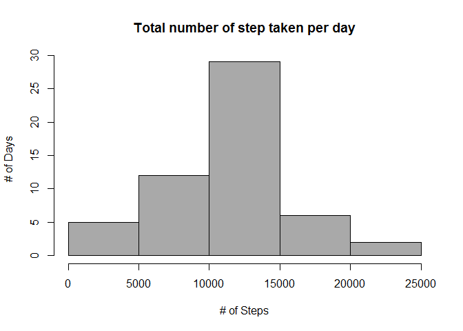

# Reproducible Research: Peer Assessment 1


## Loading and preprocessing the data


```r
unzip("activity.zip")
activity <- read.csv("activity.csv")
```

## What is mean total number of steps taken per day?


```r
q1 <- aggregate(activity[,1],list(activity$date),sum,na.rm = TRUE)
hist(q1[,2], main = "Total number of step taken per day", xlab = "# of Steps", ylab = "# of Days", col = "grey")
```

 

The mean total number of steps taken per day is 9354.2295082, the medium total number of steps taken per day is 10395.

## What is the average daily activity pattern?


```r
q2 <- aggregate(activity[,1],list(activity$interval), mean, na.rm = TRUE)
q2m <- max(q2[,2])
plot(x=q2[,1], y=q2[,2], type = "l", main = "Average Daily Activity Pattern", xlab = "Interval", ylab = "Average Steps")
```

 

The interval, on average across all the days in the dataset, contains the maximum number of steps is 835.

## Imputing missing values
Total number of NAs is `sum(is.na(activity$steps))`.
 


```r
##My strategy of filling in the NAs is using the average steps taken for that specific interval.
##Create a new column in activity called nsteps that fills in all the NA with the average of that interval.
names(q2) <- c("interval","average")
nactivity <- activity
nactivity$nsteps <- ifelse(is.na(nactivity$steps), q2[q2$interval == nactivity$interval,2], nactivity$steps)
q3 <- aggregate(nactivity$nsteps,list(nactivity$date),sum)
hist(q3[,2], main = "Total number of step taken per day", xlab = "# of Steps", ylab = "# of Days", col = "dark grey")
```

 

The mean total number of steps taken per day is NA, the medium total number of steps taken per day is NA. This mean and median is different from what we had in question one. Inputting missing data made the result more reliable. 

## Are there differences in activity patterns between weekdays and weekends?

```r
library(lattice)
## Create a column with the weekday info using "weekdays" function. Catogorize Sunday and Saturday as weekends and Monday through Friday as weekdays.
Sys.setlocale("LC_TIME", "English")
```

```
## [1] "English_United States.1252"
```

```r
nactivity$temp <- weekdays(as.Date(nactivity$date), abbreviate = TRUE)
nactivity$weekdays <- ifelse(nactivity$temp %in% c("Sun","Sat"), "Weekend","Weekday")

##Calculate the average steps taken per interval.
q4 <- aggregate(nsteps~interval+weekdays, data = nactivity, mean)
xyplot(nsteps~interval | weekdays, data = q4 ,type = "l", layout = c(1,2))
```

 
